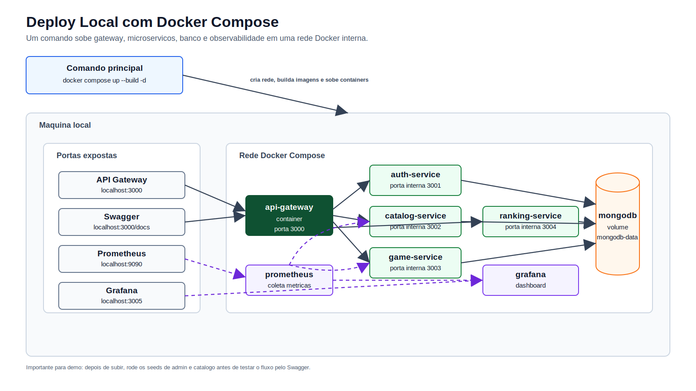
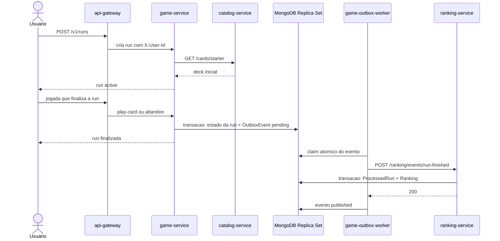

# Arquitetura

Este projeto tem dois fluxos que precisam ser entendidos separadamente:

1. O fluxo sincrono da API: o jogador chama o gateway e recebe a resposta do `game-service`.
2. O fluxo assincrono do ranking: a run finalizada gera um evento persistido; o worker o entrega depois ao ranking.

Separar esses fluxos evita um diagrama com muitas setas e deixa claro que o `game-service` nao chama o ranking durante a requisicao do jogador.

## Fluxo logico da finalizacao de uma run

Fonte editavel: [architecture-logical.mmd](diagrams/architecture-logical.mmd).

Como ler, da esquerda para a direita:

1. Cliente e gateway chamam o `game-service`.
2. O jogo consulta o catalogo quando precisa de cartas, inimigos ou bosses.
3. Ao finalizar a run, o jogo atualiza `runs`, `battles` e `rewards` e cria `outboxevents` na mesma transacao MongoDB.
4. O `game-outbox-worker` faz claim do evento pendente e chama o ranking internamente.
5. O ranking grava `processedruns` e atualiza `rankings` na mesma transacao, impedindo que o mesmo `runId` seja aplicado duas vezes.

## Deploy local com Docker Compose

Fonte editavel: [deploy-local.mmd](diagrams/deploy-local.mmd).

Pontos importantes do deploy:

- Apenas gateway, Prometheus e Grafana possuem portas publicadas no host.
- O worker usa a porta interna `3005` para `/live`, `/health` e `/metrics`; ela nao e publicada no host.
- `mongo-init-replica` executa uma vez e inicializa o Replica Set `rs0` antes dos servicos que dependem do banco.
- O worker pertence ao profile `outbox`. Em uma migracao com ranking antigo, execute o reset confirmado antes de ativar esse profile.

## Fluxo de uma run

Se o ranking estiver indisponivel, o worker nao perde o evento: ele agenda retry com backoff. Na decima falha, ou diante de um `4xx` permanente, o evento vira `dead_letter` e pode ser reenviado manualmente.

## Responsabilidades

| Componente | Papel |
|---|---|
| `api-gateway` | Entrada publica, JWT, CORS, rate limit e proxy. |
| `auth-service` | Cadastro, login e usuarios. |
| `catalog-service` | Cartas, inimigos e bosses. |
| `game-service` | Runs, batalhas, recompensas e criacao atomica do evento de outbox. |
| `game-outbox-worker` | Claim, retry, dead-letter e entrega do evento ao ranking. |
| `ranking-service` | Ranking idempotente por `runId`. |
| `mongo-init-replica` | Inicializacao idempotente do Replica Set local. |
| `mongodb` | Dados do jogo, outbox e ranking; permite transacoes locais. |
| `prometheus` | Coleta `/metrics`, inclusive do worker. |
| `grafana` | Dashboard sobre Prometheus. |

## Garantias e limites

- O jogo usa transacoes para evitar atualizacoes parciais entre batalha, run, recompensa e outbox.
- A entrega da outbox e pelo menos uma vez. O ranking transforma isso em efeito unico usando `processedruns`.
- O ranking pode demorar alguns segundos para refletir uma run: isso e consistencia eventual intencional.
- O Replica Set local possui um no e serve apenas para desenvolvimento. Producao exige alta disponibilidade real, com MongoDB gerenciado ou varios membros.
