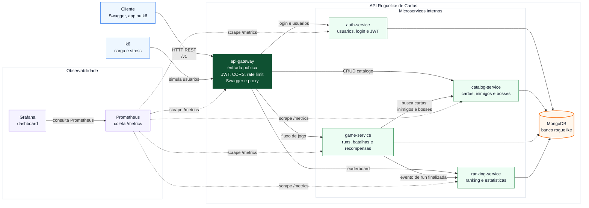
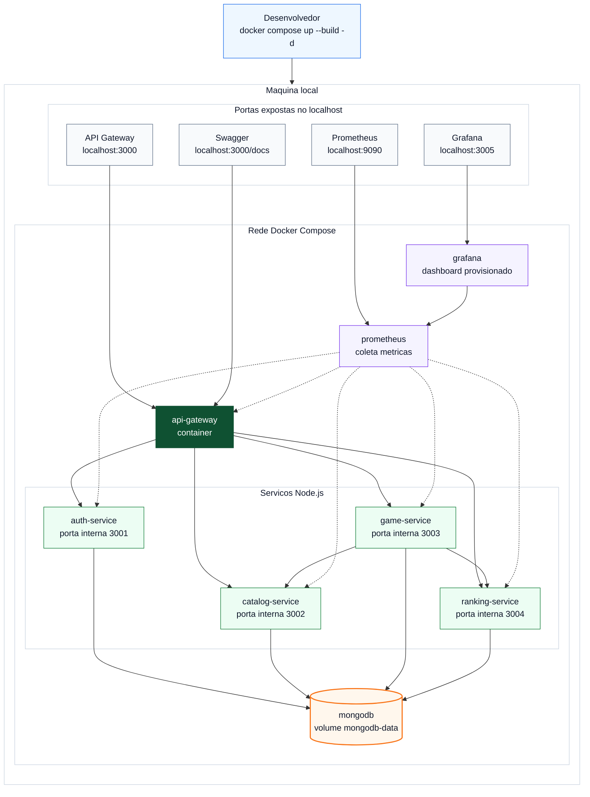
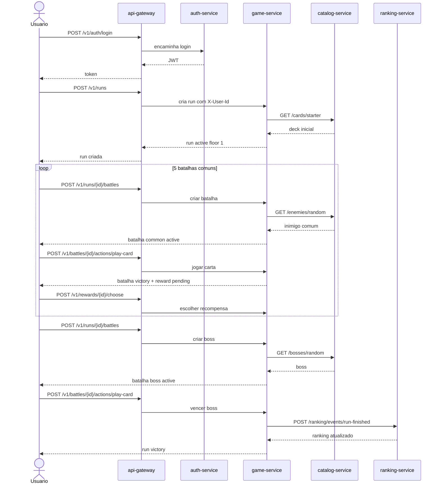

# Arquitetura

## Desenho recomendado para apresentacao

Use este diagrama no slide de arquitetura. Ele segue a ideia de um diagrama de containers: mostra a entrada publica, os microservicos, o banco, as ferramentas de observabilidade e as comunicacoes principais.

Arquivos prontos:

```text
docs/diagrams/architecture-logical.mmd
docs/diagrams/architecture-logical.svg
```

Use o `.svg` no Gamma/Canva. Use o `.mmd` se quiser editar o diagrama no Mermaid.



## Deploy local com Docker Compose

Use este segundo diagrama se quiser reforcar o slide de Docker ou Deploy.

Arquivos prontos:

```text
docs/diagrams/deploy-local.mmd
docs/diagrams/deploy-local.svg
```

Use o `.svg` no Gamma/Canva. Use o `.mmd` se quiser editar o diagrama no Mermaid.



## Como explicar o desenho

Use esta fala curta:

> O cliente nunca chama os microservicos diretamente. Toda requisicao entra pelo api-gateway, que valida JWT, aplica CORS/rate limit e encaminha para o servico correto. O game-service conversa internamente com o catalog-service para buscar cartas, inimigos e bosses, e envia um evento ao ranking-service quando a run termina. Todos persistem no MongoDB. Em paralelo, Prometheus coleta metricas dos servicos e Grafana exibe o dashboard.

## Fluxo de uma run



## Responsabilidade dos servicos

| Servico | Papel |
|---|---|
| `api-gateway` | Porta publica da API. Valida JWT, aplica CORS/rate limit e encaminha para os servicos internos. |
| `auth-service` | Cadastra usuarios, faz login, gera JWT e guarda usuarios. |
| `catalog-service` | Gerencia catalogo de cartas, inimigos e bosses. |
| `game-service` | Controla regras da run, batalhas, recompensas e fim da run. |
| `ranking-service` | Atualiza e consulta ranking. |
| `mongodb` | Persiste dados de todos os servicos. |
| `prometheus` | Coleta metricas dos endpoints `/metrics`. |
| `grafana` | Exibe dashboard com saude, requests, erros e latencia. |

## Fluxo principal

1. Usuario faz login em `POST /v1/auth/login`.
2. Gateway valida JWT nas rotas protegidas.
3. Usuario cria run em `POST /v1/runs`.
4. `game-service` busca cartas iniciais no `catalog-service`.
5. Usuario cria e joga batalhas.
6. Apos 5 batalhas comuns, o `game-service` cria o boss.
7. Ao finalizar a run, o `game-service` envia evento ao `ranking-service`.
8. Prometheus coleta metricas de todos os servicos.
9. Grafana exibe dashboard provisionado.
