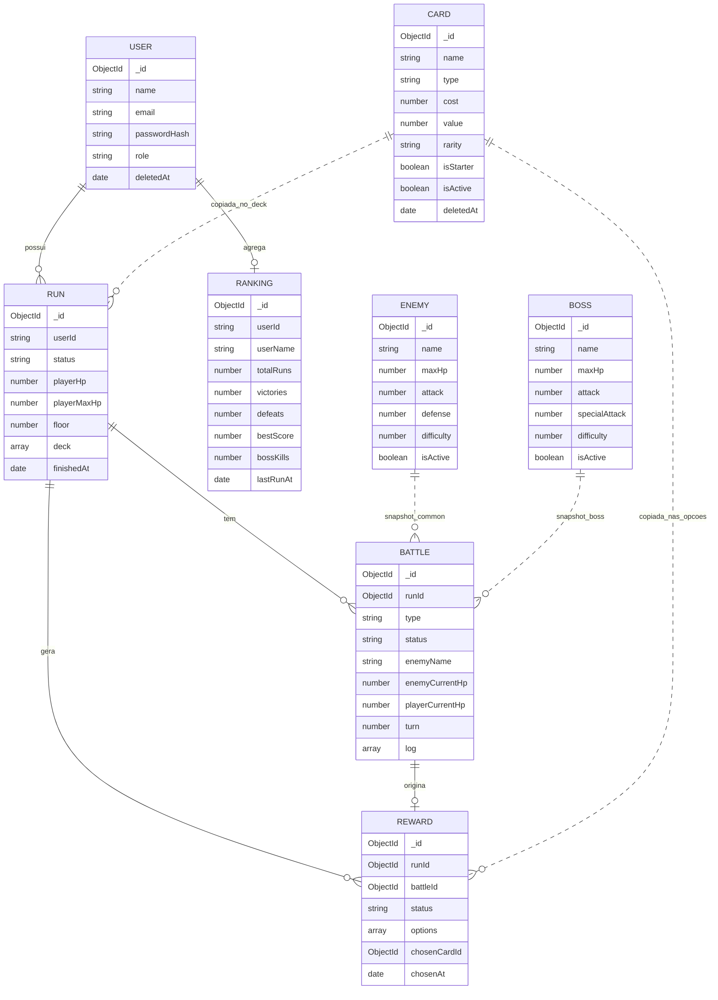

# Modelagem MongoDB

Este projeto usa MongoDB com Mongoose. A modelagem mistura referencias e snapshots:

- Referencia: quando um documento precisa apontar para outro, como `Battle.runId`.
- Snapshot: quando o jogo precisa guardar uma copia do estado no momento da run, como uma carta dentro do `deck` ou os dados do inimigo dentro da batalha.

Isso evita um problema comum: se o admin editar uma carta ou inimigo depois, runs antigas continuam com o historico correto.

## Diagrama das colecoes



## Colecoes por servico

| Servico | Colecoes |
|---|---|
| `auth-service` | `users` |
| `catalog-service` | `cards`, `enemies`, `bosses` |
| `game-service` | `runs`, `battles`, `rewards` |
| `ranking-service` | `rankings` |

## Exemplo: Card

Uma carta e um item de catalogo. O admin pode criar, editar e desativar.

```json
{
  "_id": "664000000000000000000010",
  "name": "Golpe",
  "description": "Causa 6 de dano ao inimigo.",
  "type": "attack",
  "cost": 1,
  "value": 6,
  "rarity": "basic",
  "isStarter": true,
  "isActive": true,
  "deletedAt": null,
  "createdAt": "2026-06-04T00:00:00.000Z",
  "updatedAt": "2026-06-04T00:00:00.000Z"
}
```

Campos importantes:

- `type`: define o efeito da carta: `attack`, `block` ou `heal`.
- `isStarter`: define se entra no deck inicial.
- `isActive`: permite soft delete sem apagar historico.

Consulta equivalente:

```js
db.cards
  .find({ isActive: true, type: "attack", rarity: "basic" })
  .sort({ name: 1 })
  .skip((page - 1) * limit)
  .limit(limit)
```

## Exemplo: Run

Uma run representa uma tentativa do jogador.

```json
{
  "_id": "665000000000000000000100",
  "userId": "user-001",
  "status": "active",
  "playerHp": 80,
  "playerMaxHp": 80,
  "floor": 1,
  "deck": [
    {
      "cardId": "664000000000000000000010",
      "name": "Golpe",
      "type": "attack",
      "cost": 1,
      "value": 6,
      "rarity": "basic"
    },
    {
      "cardId": "664000000000000000000011",
      "name": "Defesa",
      "type": "block",
      "cost": 1,
      "value": 5,
      "rarity": "basic"
    }
  ],
  "finishedAt": null,
  "createdAt": "2026-06-04T00:00:00.000Z",
  "updatedAt": "2026-06-04T00:00:00.000Z"
}
```

Por que o `deck` fica dentro da run?

- O deck muda durante a run.
- A carta e copiada como snapshot.
- Se o catalogo mudar depois, a run continua consistente.

Status possiveis:

- `active`: run em andamento.
- `victory`: boss vencido.
- `defeat`: jogador morreu.
- `abandoned`: jogador abandonou.

Consulta equivalente:

```js
db.runs
  .find({ userId: "user-001", status: "active" })
  .sort({ createdAt: -1 })
```

Observacao importante para a apresentacao:

- A `Run` guarda o estado da tentativa: `status`, `floor`, HP, deck e data de finalizacao.
- O score final nao fica como campo principal da `Run`.
- Quando a run termina, o resultado alimenta a colecao `rankings`, principalmente o campo `bestScore`.
- O `ranking-service` calcula o score no servidor a partir de `status` e `floor`; ele nao aceita `score` arbitrario enviado no payload.

## Exemplo: Battle

Uma batalha pertence a uma run.

```json
{
  "_id": "665000000000000000000200",
  "runId": "665000000000000000000100",
  "type": "common",
  "status": "active",
  "enemyId": "664000000000000000000020",
  "enemyName": "Goblin",
  "enemyMaxHp": 30,
  "enemyCurrentHp": 18,
  "enemyAttack": 6,
  "enemyDefense": 0,
  "enemySpecialAttack": 0,
  "playerHpAtStart": 80,
  "playerCurrentHp": 74,
  "playerBlock": 0,
  "turn": 2,
  "log": [
    "Batalha contra Goblin iniciada.",
    "Jogador usou Golpe e causou 6 de dano.",
    "Inimigo atacou causando 6 de dano."
  ],
  "finishedAt": null
}
```

Por que os dados do inimigo sao copiados?

- A batalha precisa preservar o inimigo como ele era naquele momento.
- Editar o catalogo nao muda batalhas antigas.
- O campo `log` permite mostrar historico simples da luta.

Status possiveis:

- `active`
- `victory`
- `defeat`

## Exemplo: Reward

Depois de vencer uma batalha comum, a run recebe uma recompensa pendente.

```json
{
  "_id": "665000000000000000000300",
  "runId": "665000000000000000000100",
  "battleId": "665000000000000000000200",
  "status": "pending",
  "options": [
    {
      "cardId": "664000000000000000000030",
      "name": "Bola de Fogo",
      "type": "attack",
      "cost": 2,
      "value": 12,
      "rarity": "rare"
    },
    {
      "cardId": "664000000000000000000031",
      "name": "Muralha",
      "type": "block",
      "cost": 2,
      "value": 10,
      "rarity": "common"
    },
    {
      "cardId": "664000000000000000000032",
      "name": "Cura Maior",
      "type": "heal",
      "cost": 2,
      "value": 12,
      "rarity": "rare"
    }
  ],
  "chosenCardId": null,
  "chosenAt": null
}
```

Regra importante:

- `options` deve ter exatamente 3 cartas.
- Enquanto `status` for `pending`, nao pode iniciar a proxima batalha.
- Depois da escolha, o status vira `chosen`.

## Exemplo: Ranking

O ranking e agregado por usuario. Cada run finalizada atualiza os contadores.

```json
{
  "_id": "666000000000000000000400",
  "userId": "user-001",
  "userName": "Ana Souza",
  "totalRuns": 12,
  "victories": 4,
  "defeats": 8,
  "bestScore": 600,
  "bossKills": 4,
  "lastRunAt": "2026-06-04T00:00:00.000Z"
}
```

Consulta equivalente:

```js
db.rankings
  .find({})
  .sort({ bestScore: -1 })
  .skip((page - 1) * limit)
  .limit(limit)
```

Ordenacoes suportadas pela API:

- `bestScore`
- `victories`
- `totalRuns`
- `lastRunAt`

O ranking tem paginacao por `page` e `limit`. Nao trate "filtro por periodo" como funcionalidade atual, porque isso nao esta implementado no codigo.

## Indices principais

| Colecao | Indice | Motivo |
|---|---|---|
| `users` | `{ email: 1 }` unico | login e evitar email duplicado |
| `users` | `{ role: 1 }` | listagem/controle administrativo |
| `cards` | `{ isActive: 1 }` | soft delete e listagem ativa |
| `cards` | `{ isStarter: 1, isActive: 1 }` | montar deck inicial |
| `enemies` | `{ isActive: 1 }` | buscar inimigos ativos |
| `bosses` | `{ isActive: 1 }` | buscar bosses ativos |
| `runs` | `{ userId: 1, status: 1 }` | buscar run ativa e historico do usuario |
| `battles` | `{ runId: 1 }` | buscar batalhas da run |
| `rewards` | `{ runId: 1 }` | buscar recompensa pendente |
| `rankings` | `{ userId: 1 }` unico | um ranking agregado por usuario |
| `rankings` | `{ bestScore: -1 }` | ordenacao do ranking geral |
| `rankings` | `{ victories: -1 }` | ordenacao alternativa |

## Como explicar em apresentacao

Use esta frase:

> O catalogo guarda os modelos editaveis de cartas, inimigos e bosses. Quando uma run ou batalha acontece, copiamos os dados principais como snapshot para preservar o historico do jogo. Assim, uma carta alterada pelo admin nao muda uma run antiga.
